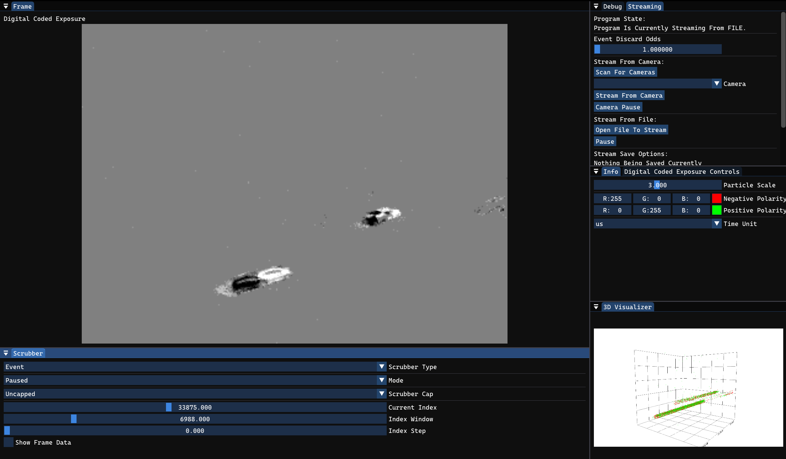
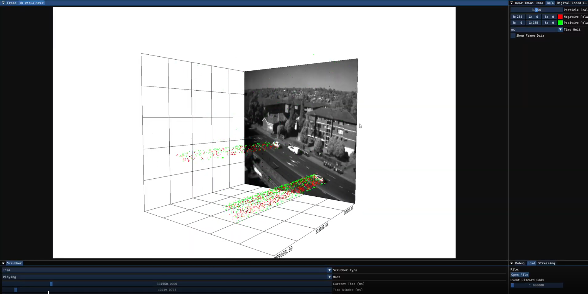
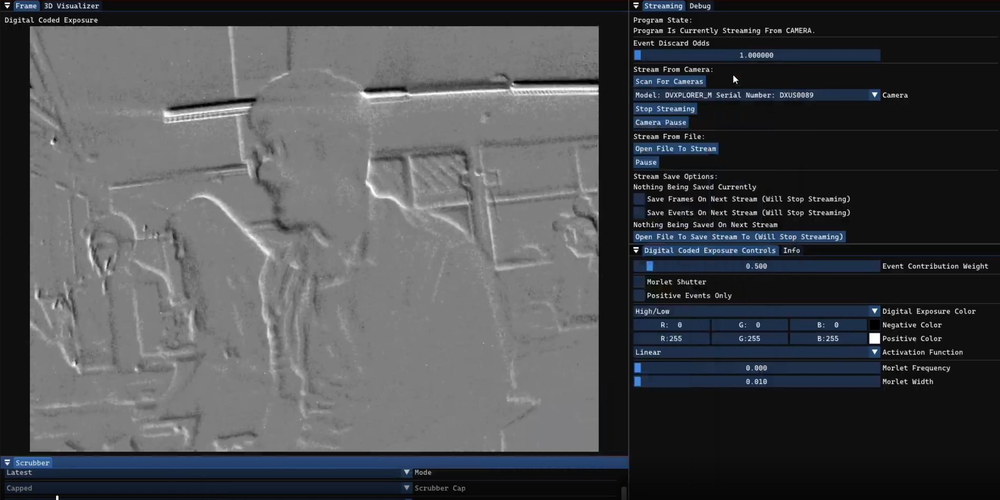

# NOVA PHASE 2
Neuromorphic Optics and Visualization Application.
Welcome to phase 2 of NOVA. This phase includes a rewrite of NOVA that follows a more modular architectural paradigm with streaming support from a file or iniVation Neuromorphic camera.

# Table of Contents
- [Images](#images)
- [Installing For Users](#installing-for-users)
- [Installing For Developers](#installing-for-developers)
- [Documentation](#documentation)
- [Quickstart](#quickstart)
- [Next Phase Features](#next-phase-features)
- [References](#references)

# Images




# Installing For Users
To install NOVA for users, go to the latest release and download the zip file of the release. Unzip the downloaded zip file and launch NOVA.exe inside the unzipped file.

# Installing For Developers

## Windows
### WSL
Developers can use WSL to manage git cloning should they choose to do so.
### CMake
NOVA uses CMake as the build system. [CMake install instructions](https://cmake.org/download/)
### Ninja
Since vcpkg and NOVA rely on Ninja for the low level build system, install Ninja by typing the following in PowerShell:
```
winget install Ninja-build.Ninja
```
### vcpkg
NOVA on Windows requires the vcpkg package manager due to the dv-processing dependency. [vcpkg install instructions](https://learn.microsoft.com/en-us/vcpkg/get_started/get-started?pivots=shell-powershell)
### Visual Studio
vcpkg requires an instance of Visual Studio to run correctly (there are cumbersome ways to get it to use Clang that have not been tried). Download the [Visual Studio Installer](https://visualstudio.microsoft.com/downloads/). When installing from Visual Studio Installer, select the Desk development with C++ Workload with the C++ Clang tools for Windows added. Note, majority of development was done using Visual Studio version 2022. Should the next team run into issues, try switching to Visual Studio version 2022.
### Visual Studio Code
Download Visual Studio Code. This was found to work the best as a development environment. Install the C/C++, C/C++ Extension Pack, C/C++ Themes, CMake Tools, and WSL extensions. From Visual Studio Code, open the folder containing the git repo for this project. Visual Studio Code should automatically start configuring the build. The preset (release or debug) can be selected from the CMake panel on the left side of the Visual Studio Code window. Building with the debug preset may produces issues with static asserts in DV-Processing, kindly comment out these two lines and build again. Building with the release preset seems to have no such issues. To build, click on the Build button on the bottom left corner of the Visual Studio Code window. To launch the application, the bottom left corner of the Visual Studio Code application offers the play button for regular launching and the debug symbol for launching in debug mode.
### Testing
Ensure the tester.exe build target is built. In the Visual Studio Code terminal, cd into the build directory and type ctest. All tests should passes. Unit tests are conducted for EventData and ParameterStore. Integration tests are conducted for DataAcquisition, EventData, and DataWriter.

## Linux
### CMake
NOVA uses CMake as the build system. You can probably install it using your distro's package manager. Otherwise: [CMake install instructions](https://cmake.org/download/)
### Package manager
Most of the packages NOVA needs will be pulled automatically through CMake's FetchContent.
However depending on the system, some internal libraries used by our dependencies may need
to be manually installed. For example SDL3 will require some library to be able to create
the native window, so wayland devel may be needed.
### clang
The clang compiler will need to be installed, the easiest way is to use the one provided
with your distro's package manager.

## CMake Commands
Note, running these commands in powershell does not seem to work on Windows. Use the Visual Studio Code method mentioned above.
### List all presets available for a system
```
cmake --list-presets
```

### Generate build files
```
cmake --preset preset-name
```
Where preset-name is one of the presets given in the previous step.

### Invoke the build
```
cmake --build ./build --parallel
```

# Documentation
The documentation is generated using Doxygen and is hosted at [Github Pages](https://utsawb.github.io/nova/).

# Quickstart
## Streaming Data


Users can stream data from the Streaming window shown above.
To stream from the camera, users can click the Scan For Cameras button to populate the Camera dropdown. From the Camera dropdown, users can select the desired, detected camera to stream from. Once the camera is selected, users click the Stream From Camera button to start the streaming.

To stream from a file, users can click the Open File To Stream button to select an aedat4 file to stream from. Streaming from the file will begin as soon as a file is selected.

The Event Discard Odds determines the odds that event data is randomly discarded. This setting is useful when streaming from a camera.

Users can click the Open File To Save Stream To to select/create an aedat4 file to stream data to. Users can select the Save Frames on Next Stream and/or Save Events On Next Stream checkboxes to save frame and/or event data to the save file. Selecting any of the these options will stop streaming. To start saving, start streaming from a file or camera with these save options set.

## 3D Visualizer


The 3D Visualizer is given above. It is a point particle plot. Each point in the plot represents event data. The colors used to represent event polarity for each particle as well as particle scales can be changed in the Info window. The axis with text is the time axis. The other bottom axis is the x-pixel dimension of the event data. The vertical axis is the y-pixel dimension of the event data. Frame data will be shown should the Show Frame Data checkbox be selected in the Scrubber window and should there be frame data received.

## Digital Coded Exposure


The Digital Coded Exposure attempts to reconstruct frame data out of event data. The controls are given in the Digital Coded Exposure Controls window. There, the user can select the color scheme, enable Morlet shutter contribution calculations, choose the activation function (how each pixel's color is determined from event contributions), etc. It should be noted that due to limitations in Vulkan shaders (specifically, the inability to atomically add floating point numbers), the Morlet shutter will not work for high Current Index (Time) slider values in the Scrubber window. To see Morlet Shutter output, a smaller data file with with high Morlet Frequency and Morlet Width values is recommended.


## Scrubbing Data


Users can determine what data is shown in the Digital Coded Exposure and 3D Visualizer windows by using the Scrubber window. The Scrubber Type determines what the controls are based off of (event based or time based). The Mode provides three ways to view data: Paused allows the user to scrub through past data, Playing allows the user to play through data (controlled by the Index (Time) Step) slider, and Latest fixes the Current Index (Time) to the latest received data (very useful when streaming from a camera). The Scrubber Cap puts a cap on the sliders to handle situations where huge amounts of data reduce the precision of the slider controls. The Current Index (Time) determines the last event point being shown in the visualizations. The Index (Time) Window determines the number of events before the Current Index (Time) that are shown in the visualizations. For the Digital Coded Exposure, the Index (Time) Window is basically the shutter length. The Index (Time) Step determines the increment to the Current Index (Time) for each frame should the Playing Mode be selected.

# Next Phase Features
Here are some suggestions for next phase features:
- PCA support
- Fixes to Morlet Shutter (either by finding better workarounds for atomic add floating point operations or rearchitecting the whole digital coded exposure functionality)
- Multi-camera support (multi-stereo)

# References
- [NOVA Phase 1 team](https://github.com/andrewleachtx/nova) which NOVA Phase 2 is based heavily off of (in terms of project requirements).
- [SDL3 wiki](https://wiki.libsdl.org/SDL3/FrontPage)
- [Dear ImGui](https://github.com/ocornut/imgui)
- [DV-Processing](https://dv-processing.inivation.com/master/index.html)
- [iniVation docs](https://docs.inivation.com/_static/inivation-docs_2025-08-05.pdf)

