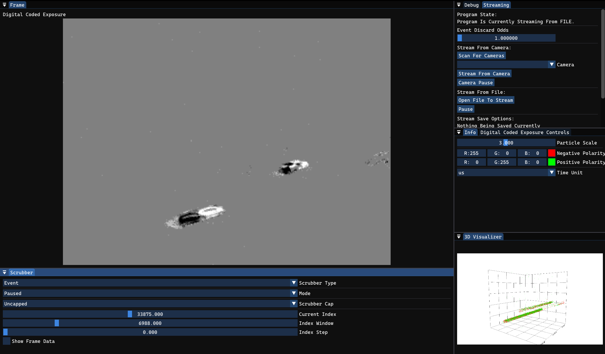
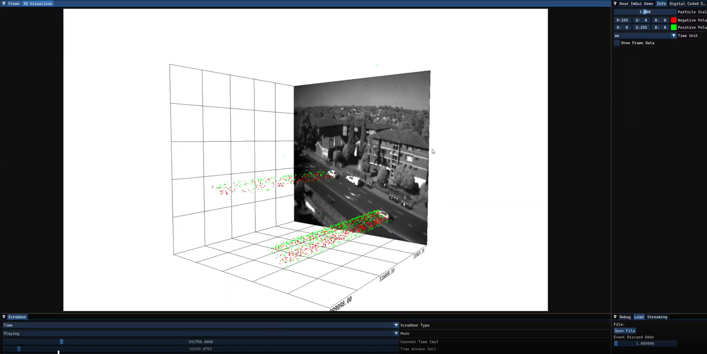
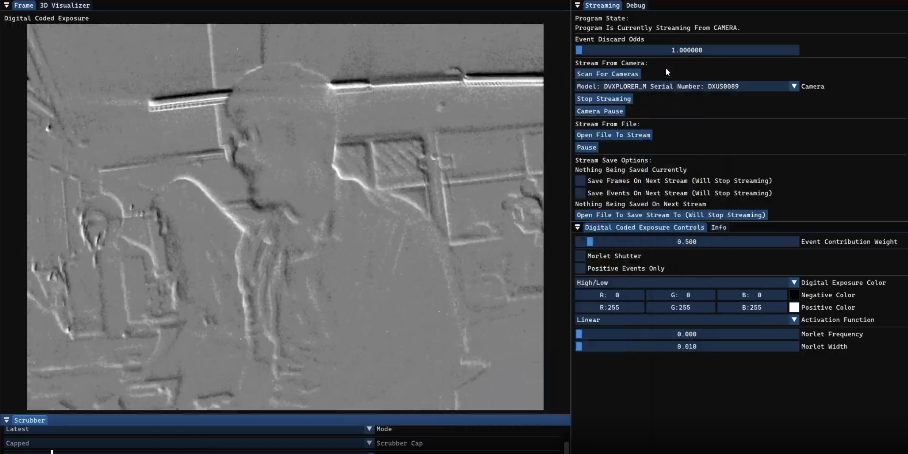

# NOVA - Neuromorphic Optics and Visualization Application


NOVA is a visualization platform with support for 2D and 3D visualization of data from neuromorphic cameras.

## Phase 3 Team

Jack Lewicki, Ryan O'Mullan, Ashley Zhang, Cole Greinke, and Neil Kodali

## Citation
Andrew Lin, Daniel Querrey, Eric McGonagle, John Langs, Nai Yun Wu, John Ho, Nick Almeter, Matthew Fisher, Utsawb Lamichhane, Praket Desai, David Mascarenas, Tracy Hammond, “Late breaking news: NOVA: Real-Time Visualization and Streaming for Neuromorphic Event Cameras,” NICE 2026, Atlanta, GA. 

---

Late breaking news: NOVA: Real-Time Visualization and Streaming for Neuromorphic Event Cameras

* [Presentation PDF](https://flagship.kip.uni-heidelberg.de/jss/HBPm?m=displayPresentation&mI=282&mEID=10228)
* [Talk Video](https://flagship.kip.uni-heidelberg.de/video/meeting_282_video_10228.mp4)
* [Abstract](https://flagship.kip.uni-heidelberg.de/jss/HBPm?mI=282&m=showAgenda&withLength=Y&showAbstract=10228#10228)

Andrew Lin, Daniel Querrey, Eric McGonagle, John Langs, Nai Yun Wu, John Ho, Nick Almeter, Matthew Fisher, Utsawb Lamichhane, Praket Desai, David Mascarenas, Tracy Hammond; Texas A&M University & Los Alamos

* [NICE Conference Series](https://flagship.kip.uni-heidelberg.de/jss/HBPm?mI=282&m=showAgenda&withLength=Y)
---

## Building from Source

### Prerequisites

- **CMake** 3.24 or higher
- **Ninja** build system
- **Clang** compiler with C++23 support
- **Vulkan SDK** - [Download here](https://vulkan.lunarg.com/sdk/home)

### macOS

Install pkg-config (required by dv-processing):
```
brew install pkg-config
```

### Build Steps

1. Clone the repository:
   ```
   git clone https://github.com/ashlxyzhang/nova.git
   cd nova
   ```

2. Clone and bootstrap vcpkg into the `vcpkg/` directory:
   ```
   git clone https://github.com/microsoft/vcpkg.git vcpkg
   ./vcpkg/bootstrap-vcpkg.sh    # Linux/macOS
   .\vcpkg\bootstrap-vcpkg.bat   # Windows
   ```

3. Configure and build:
   ```
   cmake --preset release
   cmake --build ./build --parallel
   ```

   Available presets: `debug`, `release`, `packaging`

   Note that it can takes several hours for vcpkg to install everything the first time `cmake --preset release` is run.

## Packaging

To build a redistributable (`.dmg` on macOS, `.tar.gz` on Linux, `.zip` on Windows):

```
cmake --preset packaging
cmake --build --preset packaging
cd build-packaging && cpack
```

The package bundles the Metavision HAL plugins, and on macOS also bundles MoltenVK so end users don't need the Vulkan SDK. On Linux/Windows, a working GPU driver with Vulkan support is required (standard on any modern machine).

## Integrating NOVA into Your C++ Project

NOVA builds into a static library (`nova_lib.lib`) that includes all the features of the main application (except for `main.cc`). Add NOVA to your project as a git submodule or clone directly with the following commands:

```
cd YourProject
git submodule add https://github.com/ashlxyzhang/nova.git external/NOVA
git submodule update --init --recursive
```
OR
```
git clone https://github.com/ashlxyzhang/nova.git external/NOVA
```

Then add NOVA to your CMakeLists.txt with the following lines (there are many ways of going about this but 'add_subdirectory' requires the least amount of work): 

```
add_subdirectory(external/NOVA)
...
target_link_libraries(my_app PRIVATE nova_lib)
```

See `tests/integration/api_test.cc` for examples of the API being used. Note that the entire project is wrapped in the `nova` namespace. There are five includes for nova: `nova/nova.hh`, `nova/render.hh`, `nova/data.hh`, `nova/ui.hh`, and `nova/slam.hh`. (Just use `#include <nova/nova.hh>` if you want everything).


## 3D Reconstruction Instructions
The 3D Reconstruction in NOVA is implemented using the ESVO2 algorithm.

### Configuration
The 3D reconstruction is configured by using six YAML files. Explanation for the parameters of these files can be found at the original [ESVO2 github](https://github.com/NAIL-HNU/ESVO2). It is probably easiest to just use or slightly modify the example files found in src/SLAM/esvo2_core/cfg/mapping, src/SLAM/esvo2_core/cfg/tracking, and src/SLAM/image_representation/cfg. Please note that NOVA does not currently support IMUs, so the tracking parameter `USE_IMU` will always be set to false. If you want a more dense global point cloud, setting the mapping parameter `visualizeGPC_interval` to 0 or a value near 0 has worked pretty well for us.

### Camera Calibration
Users must calibrate their stereo setup themselves. The left and right camera calibration should be put in separate YAML files. You can view examples of the expected format in src/SLAM/esvo2_core/calib.

### Running the Algorithm
First, navigate to the Data Sources tab and load two cameras or two files. **The first data source you load should correspond to the left camera and the second to the right camera.** Click `Read` for both data sources and set `View Mode` to `Synced`.

Next, navigate to the 3D Reconstruction tab and load in your configuration YAML files. There are some default file paths loaded, but they may be invalid depending on how you downloaded NOVA.

Next, navigate to the Scrubber tab and ensure both `Window` and `Step` are set to nonzero values. When testing on the DSEC dataset, having `Window` be about 10 and `Step` around 5 worked well for us, but other values will also work. Click `Play` to begin reading in the event data. If you are using live data from cameras, you can skip to read the latest events by clicking the `>|` button.

Finally, in the 3D reconstruction tab, click `Start 3D Reconstruction`. The point cloud will now show up in the 
3D Visualizer. It may take a few seconds for the grid to go away, while everything is initializing. **Sometimes the point cloud will not be immediately visible on the 3D visualizer. The points will sometimes spawn to the right or left of where the 3D visualizer initially faces. If this is the case, rotate the 3D visualizer using your mouse to see the point cloud.**

### Show Global Pointcloud
If `Show Global Pointcloud` is toggled on, the 3D visualizer will show the left camera's estimated location as a black line. It will also display the full reconstruction of the scene as a 3D point cloud. The point cloud is updated in set intervals based on the mapping's YAML file `visualizeGPC_interval` parameter. The colors of the points indicate the distance from the camera's initial position with red being close and blue being far.

If `Show Global Pointcloud` is toggled off, the 3D visualizer will show only the latest depth information from the algorithm. This information is still represented in 3D space, so you may have to move the camera to view it from the proper angle. The colors indicate the distance from the camera's current estimated position. Red is close and blue is far.

### Camera Controls
Rotate by dragging the mouse.
Zoom in/out by scrolling.
Use w/a/s/d/q/e to move forward/left/back/right/up/down respectively.

### Additional notes
We ran our implementation on a scene from the [DSEC dataset](https://dsec.ifi.uzh.ch/dsec-datasets/download/). The dataset does not provide files in the format NOVA uses, so we made a small python program to convert from the DSEC .h5 to .dat files. This program and instruction for running it can be found at: src/SLAM/refactor_files/unused/h5_to_dat.py.


## References
The 3D reconstruction uses a modified version of the [ESVO2 Algorithm](mhttps://github.com/NAIL-HNU/ESVO2).

[ESVO2: Direct Visual-Inertial Odometry with Stereo Event Cameras](https://arxiv.org/abs/2410.09374), *Junkai Niu, Sheng Zhong, Xiuyuan Lu, Shaojie Shen, Guillermo Gallego, Yi Zhou*, IEEE Transactions on Robotics (T-RO), 2025. [PDF](https://arxiv.org/abs/2410.09374), [Video](https://youtu.be/gmAU32Oeiv8).

We also cloned and used [Minkindr](https://github.com/ethz-asl/minkindr) in the 3D reconstruction.

We adapted some code from ROS Noetic in order to implement the 3D reconstruction. A link to the file we adapted can be found [here](https://github.com/ros/ros_comm/blob/noetic-devel/utilities/message_filters/include/message_filters/sync_policies/approximate_time.h).

This is the 3rd phase of NOVA. Our work would not have been possible wihtout the work of [Phase 1](https://github.com/andrewleachtx/nova) and [Phase 2](https://github.com/Utsawb/nova?tab=readme-ov-file).

## Future Work
### General
- Support for showing frame data from traditional cameras
- Per-pixel statistics in 3D Visualizer
  - Such a feature could allow the user to click on event particles in the 3D Visualizer to get a summary of events at that pixel
- Ability to change camera bias settings
  - Requested by several people at the NICE conference
- Ability to change background color for 3D visualizer
- IMU support
  - NOVA currently handles reading in event and frame data. iniVation cameras and aedat4 files allow storage of other types of data like IMU data. A future implementation could look into handling the visualization of this IMU data
- Fix packaging errors
  - We could only confirm that packaging works for MacOS. Cleaning up some errors to also get it working on Windows/Linux would be great

### 3D Reconstruction
- Visualizing some of the intermediate cv::Mats
  - reprojMap_left in RegProblemSolverLM.cpp especially could look good
- Changing pose visualization to also show rotation
  - Currently it only connects the location of each pose. Adding in support to show the x/y/z axes for each pose could show the camera's rotation
- Ability to change the colors used in the 3D reconstruction
  - Would help people who are colorblind
- Better system for loading the configuration files
  - Current system is clunky and does not explain errors well 
- Giving 3D reconstruction its own display window
  - Currently, 3D reconstruction takes over the 3D visualizer window. Giving it its own window would allow users to see both at the same time
- Add API calls to access the 3D reconstruction features
- Support for monocular 3D reconstruction
  - This would take a lot of work and is not a high priority

<!--
# NOVA PHASE 2
Neuromorphic Optics and Visualization Application.
Welcome to phase 2 of NOVA. This phase includes a rewrite of NOVA that follows a more modular architectural paradigm with streaming support from a file or iniVation Neuromorphic camera.

For a quick overview of this project, checkout this [advertisement video](https://youtu.be/YcFe905t7Z4?si=6CtScjcc3P9zoa_D).

# Table of Contents
- [Images](#images)
- [Installing For Users](#installing-for-users)
- [Installing For Developers](#installing-for-developers)
- [Documentation](#documentation)
- [User Quickstart](#user-quickstart)
- [Roadmap (Possible Future Work)](#roadmap-possible-future-work)
- [References](#references)

# Images




# Installing For Users
To install NOVA for users, go to the latest release and download the zip file of the release. Unzip the downloaded zip file and launch NOVA.exe inside the unzipped file. Currently, only the Windows binary is available for download.

# Installing For Developers
Note, Windows is the preferred development environment. This application was developed primarily for Windows.

## Vulkan
NOVA uses the Vulkan backend for SDL3 for our Visualizer and GPGPU tasks. Please install the [VulkanSDK](https://vulkan.lunarg.com/sdk/home) to ensure you have
all the tools needed to effectivly develop for NOVA.

## Windows
### WSL
Developers can use WSL to manage git cloning should they choose to do so.
### CMake
NOVA uses CMake as the build system. [CMake install instructions](https://cmake.org/download/)
### Ninja
Since vcpkg and NOVA rely on Ninja for the low level build system, install Ninja by typing the following in PowerShell:
```
winget install Ninja-build.Ninja
```
### vcpkg
NOVA on Windows requires the vcpkg package manager due to the dv-processing dependency. [vcpkg install instructions](https://learn.microsoft.com/en-us/vcpkg/get_started/get-started?pivots=shell-powershell)
### Visual Studio
vcpkg requires an instance of Visual Studio to run correctly (there are cumbersome ways to get it to use Clang that have not been tried). Download the [Visual Studio Installer](https://visualstudio.microsoft.com/downloads/). When installing from Visual Studio Installer, select the "Desktop development with C++" Workload with the "C++ Clang tools for Windows" Individual Component added. Note, majority of development was done using Visual Studio version 2022. Should the next team run into issues, try switching to Visual Studio version 2022.
### Visual Studio Code
Download Visual Studio Code. This was found to work the best as a development environment. Install the C/C++, C/C++ Extension Pack, C/C++ Themes, CMake Tools, and WSL extensions. From Visual Studio Code, open the folder containing the git repo for this project. Visual Studio Code should automatically start configuring the build. If the necessary packages are being installed for the first time, installation can take up to 1 or 2 hours. The preset (release or debug) can be selected from the CMake panel on the left side of the Visual Studio Code window. Building with the debug preset may produces issues with static asserts in DV-Processing, kindly comment out these two lines and build again. Building with the release preset seems to have no such issues. To build, click on the Build button on the bottom left corner of the Visual Studio Code window. To launch the application, the bottom left corner of the Visual Studio Code application offers the play button for regular launching and the debug symbol for launching in debug mode.
### Testing
Ensure the tester.exe build target is built. In the Visual Studio Code terminal, cd into the build directory and type ctest. All tests should passes. Unit tests are conducted for EventData and ParameterStore. Integration tests are conducted for DataAcquisition, EventData, and DataWriter.
### Releasing
The release was created by deleting all build artifacts from the build directory and only keeping the NOVA.exe and necessary .dll files. The build directory was zipped and used as the release.

## Linux
### CMake
NOVA uses CMake as the build system. You can probably install it using your distro's package manager. Otherwise: [CMake install instructions](https://cmake.org/download/)
### Package manager
Most of the packages NOVA needs will be pulled automatically through CMake's FetchContent.
However depending on the system, some internal libraries used by our dependencies may need
to be manually installed. For example SDL3 will require some library to be able to create
the native window, so wayland devel may be needed.
### clang
The clang compiler will need to be installed, the easiest way is to use the one provided
with your distro's package manager.

## CMake Commands
Note, running these commands in powershell does not seem to work on Windows. Use the Visual Studio Code method mentioned above.
### List all presets available for a system
```
cmake --list-presets
```

### Generate build files
```
cmake --preset preset-name
```
Where preset-name is one of the presets given in the previous step.

### Invoke the build
```
cmake --build ./build --parallel
```

# Documentation
The documentation is generated using Doxygen and is hosted at [Github Pages](https://utsawb.github.io/nova/).

# User Quickstart
## Streaming Data


Users can stream data from the Streaming window shown above.
To stream from the camera, users can click the Scan For Cameras button to populate the Camera dropdown. From the Camera dropdown, users can select the desired, detected camera to stream from. Once the camera is selected, users click the Stream From Camera button to start the streaming.

To stream from a file, users can click the Open File To Stream button to select an aedat4 file to stream from. Streaming from the file will begin as soon as a file is selected.

The Event Discard Odds determines the odds that event data is randomly discarded. This setting is useful when streaming from a camera.

Users can click the Open File To Save Stream To to select/create an aedat4 file to stream data to. Users can select the Save Frames on Next Stream and/or Save Events On Next Stream checkboxes to save frame and/or event data to the save file. Selecting any of the these options will stop streaming. To start saving, start streaming from a file or camera with these save options set.

## 3D Visualizer


The 3D Visualizer is given above. It is a point particle plot. Each point in the plot represents event data. The colors used to represent event polarity for each particle as well as particle scales can be changed in the Info window. The axis with text is the time axis. The other bottom axis is the x-pixel dimension of the event data. The vertical axis is the y-pixel dimension of the event data. Frame data will be shown should the Show Frame Data checkbox be selected in the Scrubber window and should there be frame data received. Should the user's mouse get stuck in the 3D Visualizer, double-click to get the mouse unstuck.

## Digital Coded Exposure


The Digital Coded Exposure attempts to reconstruct frame data out of event data. The controls are given in the Digital Coded Exposure Controls window. There, the user can select the color scheme, enable Morlet shutter contribution calculations, choose the activation function (how each pixel's color is determined from event contributions), etc. It should be noted that due to limitations in Vulkan shaders (specifically, the inability to atomically add floating point numbers), the Morlet shutter will not work for high Current Index (Time) slider values in the Scrubber window. To see Morlet Shutter output, a smaller data file with with high Morlet Frequency and Morlet Width values is recommended.


## Scrubbing Data


Users can determine what data is shown in the Digital Coded Exposure and 3D Visualizer windows by using the Scrubber window. The Scrubber Type determines what the controls are based off of (event based or time based). The Mode provides three ways to view data: Paused allows the user to scrub through past data, Playing allows the user to play through data (controlled by the Index (Time) Step) slider, and Latest fixes the Current Index (Time) to the latest received data (very useful when streaming from a camera). The Scrubber Cap puts a cap on the sliders to handle situations where huge amounts of data reduce the precision of the slider controls. The Current Index (Time) determines the last event point being shown in the visualizations. The Index (Time) Window determines the number of events before the Current Index (Time) that are shown in the visualizations. For the Digital Coded Exposure, the Index (Time) Window is basically the shutter length. The Index (Time) Step determines the increment to the Current Index (Time) for each frame should the Playing Mode be selected.

# Roadmap (Possible Future Work)
Here are some suggestions for next phase features:
- PCA support
  - The framework for this is in place, as code from DigitalCodedExposure can be reused, however there will need to be careful considerations to be made when porting this algorithm to the GPU.
- Fixes to Morlet Shutter
  - Although Vulkan does have extensions in place for floating point atomic operations, this is not a feature that is 100% supported. The options would be to increase the minimum specs of NOVA, or figure out a better architecture for handling this data.
- Further parallelize DataAquisition
  - Although not common during real world applications of Neruomorphic cameras, when too many events are generated by the camera, latency will begin to accumilate due to NOVA needing to handle all these events.
  - A possible solution would be to further split up the work inside of DataAquisition by multi-threading the processing of the raw Frame Packets.
- Block compression of the intermediate file
  - Currently NOVA uses a memory mapped file to ensure that system ram does not run out during streaming. However this file on disk can become many gigabytes.
  - Due to its nature, this intermediate file has very high compression ratios (up to 10x in basic testing).
  - If NOVA were to write chunks of compressed event data to disk and only open ones it needs, it could not only decrease file sizes, but also open up the possibilites of using this intermediate file as an option to users to save streamed data to disk. In theory keeping the data close to how NOVA uses it should increase file loads aswell. 
- Multi-camera support (multi-stereo)
  - One interesting application of Neromorphic cameras requires many cameras to be used at once.
  - Although NOVA in its current state does not support multiple cameras, due to its modular nature it should be possible to introduce multi camera support with exsiting subsystems.
  - However one problem we forsee is running out of compute resources due to the sheer amount of data being ingested.
- Per-pixel statistics in 3D Visualizer
  - Such a feature could allow the user to click on event particles in the 3D Visualizer to get a summary of events at that pixel.
- Handling of IMU data
  - NOVA currently handles reading in event and frame data. iniVation cameras and aedat4 files allow storage of other types of data like IMU data. A future implementation could look into handling the visualization of this IMU data.

# References
- [NOVA Phase 1 team](https://github.com/andrewleachtx/nova) which NOVA Phase 2 is based heavily off of (in terms of project requirements).
- [SDL3 wiki](https://wiki.libsdl.org/SDL3/FrontPage)
- [Dear ImGui](https://github.com/ocornut/imgui)
- [DV-Processing](https://dv-processing.inivation.com/master/index.html)
- [iniVation docs](https://docs.inivation.com/_static/inivation-docs_2025-08-05.pdf)
- [Test data used for development and testing](https://nusneuromorphic.github.io/dataset/)
-->
